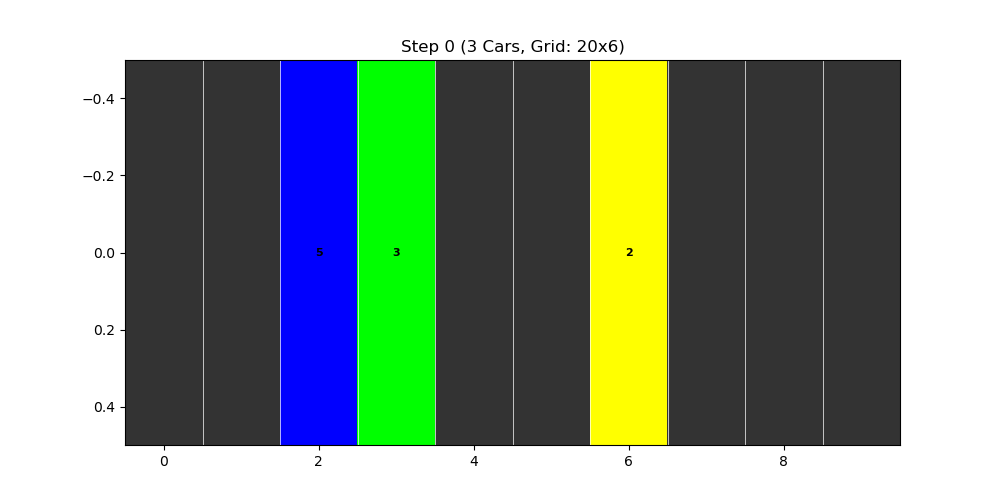
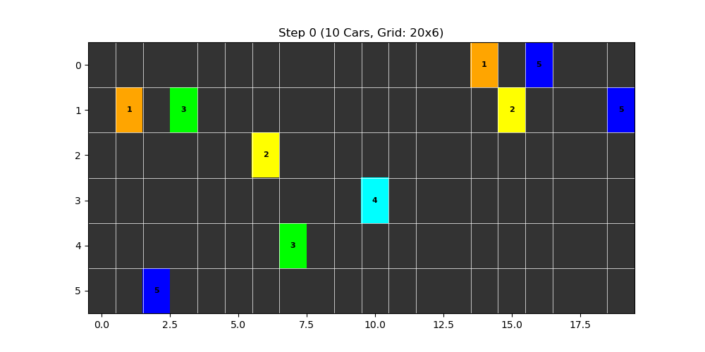

# Modeling Traffic Using the Nagel–Schreckenberg Model
#### Natalie Gray, Meredith Pritchard, Judah Byars, Inhyeok Cho, and Emma Horner

## Introduction 
Traffic flow is a classic example of a complex system in which simple local rules lead to rich global behavior. Even when all drivers behaves “normally,” large-scale stop-and-go waves can appear. Studying these emergent traffic patterns can help us understand congestion, optimize road design, and test ideas about self-organization in dynamical systems.

The Nagel–Schreckenberg (NS) model is a cellular-automaton framework used to simulate freeway traffic dynamics. It captures how traffic jams emerge as a collective phenomenon: when vehicle density increases, interactions between neighboring cars naturally lead to reduced speeds and stop-and-go patterns.

Taking inspiration from the NS model, in this project we implement a simple cellular authomaton model to simulate the onset of traffic, extending it to include lane-changing behavior in a multi-lane roadway. The roadway is represented as a discrete grid with periodic boundary conditions, where each cell is either empty or occupied by a single car with an associated velocity  $v$. Because only one vehicle can occupy a cell at a time, local interactions determine how cars accelerate, brake, or shift lanes.

Time evolves in discrete steps. At each time step, every vehicle updates its state according to the model rules: it may advance forward, change lanes (in the multi-lane case), adjust its speed, or become part of a traffic jam depending on its surroundings.

  
## Installation and Basic Usage

Requirements: 
```
pip install numpy
pip install matplotlib
```

1. Clone repository: ```git clone https://github.com/negray03/PHY-381C-Final-Project-Onset-of-Traffic/tree/main ```
2. Run models inside the ```Lanes.ipynb``` notebook:

Running the single lane model:
```
model = Traffic(n, density, vmax, p)
model.simulate(n_step)
```


Parameters:
- ```n``` (int): Length of the road (number of cells)
- ```density``` (float): Fraction of cells initially containing cars (0 to 1)
- ```vmax``` (int): Maximum allowed velocity
- ```p``` (float): Random slowdown probability (0 to 1)
- ```n_step``` (int): Number of iterations you want to simulate
     

Running the multi-lane lane model:
```
Model = Multi_Lane_Traffic(cells, lanes, density, vmax, p, random_state)
Model.simulate(n_step)
```


Parameters:
- ```cells``` (int): Length of the road (number of cells)
- ```density``` (float): Fraction of cells initially containing cars (0 to 1)
- ```vmax``` (int): Maximum allowed velocity
- ```p``` (float): Random slowdown probability (0 to 1)
- ```n_step``` (int): Number of iterations you want to simulate
-  ```random_state```: sets the random state of our simulation.

## Implementation
### Single lane implementation:
First we implement a model for single lane traffic as our baselilne/starting point.  The road is represented by a 1D-array where each position represents a “cell” or location in which a car could occupy.
We then randomly place several cars into the cells and each cell is assigned a numerical value: 
- $v = -1$     → cell is empty, no car occupies that cell
- $v = 0-5$     → cell is occupied by a car with velocity $0-5$

With these as the inititail conditions, we iterate over various time steps and the simulation evovles according to the following rules for car motion, including acceleration, slowing down, and randomization. 
******reword the following — from wikipedia*****
1. Car motion: Finally, all cars are moved forward the number of cells equal to their velocity. For example, if the velocity is $v = 3$, the car is moved forward $3$ cells.
2. Acceleration: All cars not at the maximum velocity have their velocity increased by one unit. For example, if the velocity is $v = 4$ it is increased to $5$.
3. Slowing down: All cars are checked to see if the distance between it and the car in front (in units of cells) is smaller than its current velocity (which has units of cells per time step). If the distance is smaller than the velocity, the velocity is reduced to the number of empty cells in front of the car – to avoid a collision. For example, if the velocity of a car is now 5, but there are only 3 free cells in front of it, with the fourth cell occupied by another car, the car velocity is reduced to 3.
4. Randomization: The speed of all cars that have a velocity of at least 1, is now reduced by one unit with a probability of p. For example, if $p = 0.5$, then if the velocity is 4, it is reduced to 3 50% of the time.


### Multiple lane implementation: 
Next we implement a model for multi-lane traffic. Now our road has expanded so that it is created with a 2D-array where, like before, each cell either has a car with some velocity $v = 0-5$, or is empty ($v = -1$). The multiple lanes implementation is essentially made of independent single lanes from before, with the adddition of lane changing. Due to the new interaction of changing lanes, the system now evolves raccording to the following new rules:
1. Rule 1
2. Rule 2
3. Rule 3 --- *****GET INFO FROM JUDAH WHEN HE IS DONE*****

## Results Visualization
#### Multilane model for 3 cars

#### Multilane model for 10 cars

#### Multilane model for 80 cars


### Average Flow and Jamming Fraction (2D and 3D)
We simulated cells over 100 iterations while varying the density and lane amount. Below we show the 2D and 3D average flow The 3d plots give both the average flow and jamming feaction as the z axis. The jamming percent seemed to ignore the amount of lanes, which makes sense. However, we noticed that for low densities an increase to the amount of lanes did tend to increase the average flow rate.
.png) .png)


<p align="center">
  
  
</p>


## Conclusion
- In conclusion, ....

## Applications
- some applicatoins of this model could be....

## Authors and Acknowledgments
This project was completed by Natalie Gray, Meredith Pritchard, Judah Byars, Inhyeok Cho, and Emma Horner. We want to acknowledge and thank Professor William Gilpin and Carson McVay as well. 

## Resources:
https://www.mdpi.com/1424-8220/24/23/7672 -- might have some good images for the intro
https://en.wikipedia.org/wiki/Nagel%E2%80%93Schreckenberg_model
https://jp1.journaldephysique.org/articles/jp1/abs/1992/12/jp1v2p2221/jp1v2p2221.html
https://github.com/christiancosgrove/traffic-numpy


