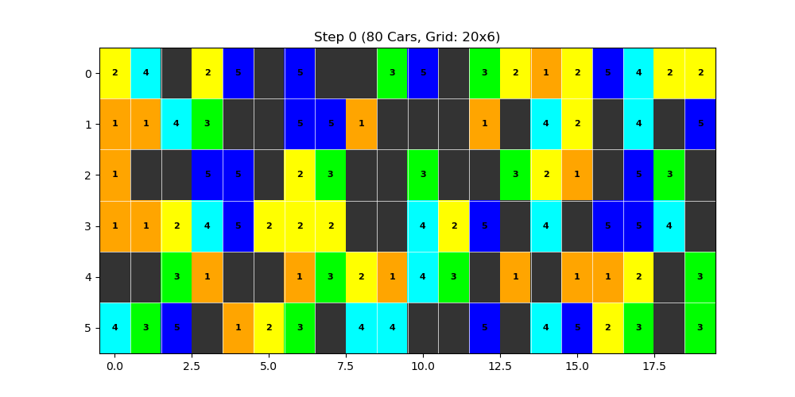

# Modeling Traffic Using the Nagel–Schreckenberg Model
#### Natalie Gray, Meredith Pritchard, Judah Byars, Inhyeok Cho, and Emma Horner

## Introduction
  ### Description: 
****** reword the following — from wikipedia*****
The Nagel-Schrenkenbreg (NS) model is a theoretical simulation of traffic on a freeway. It is essentially a cellular automaton model for road traffic flow that can reproduce traffic jams, i.e., show a slow down in average car speed when the road is crowded (high density of cars). The model shows how traffic jams can be thought of as an emergent or collective phenomenon due to interactions between cars on the road, when the density of cars is high and so cars are close to each other on average.

In our work here, we use implement a simple cellular authomaton model to simulate the onset of traffic, taking inspiration from the NS model with the addition of lane changing in a multi-lane model. The model works by creating a grid with periodic bounday conditions where each cell in the grid is either empty, or has a car with some velocity, $v$. Each grid can only be occupied by one car at a time. 

Time is discretized into time steps. So with each time step, the system evolves and cars either move forward, change lanes (in the multi-lane implementation), or slow down and get stuck in a traffic jam. 

- figure
- equation???
  
## Installation
Requirements: 
```
pip install numpy
pip install matplotlib
```

## Implementation
### Single lane implementation:
First we implement a model for single lane traffic as our baselilne/starting point.  The road is represented by a 1D-array where each position represents a “cell” or location in which a car could occupy.
We then randomly place several cars into the cells and each cell is assigned a numerical value: 
- $v = -1$     → cell is empty, no car occupies that cell
- $v = 0-5$     → cell is occupied by a car with velocity $0-5$

With these as the inititail conditions, we iterate over various time steps and the simulation evovles according to the following rules for car motion, including acceleration, slowing down, and randomization. 
******reword the following — from wikipedia*****
1. Car motion: Finally, all cars are moved forward the number of cells equal to their velocity. For example, if the velocity is $v = 3$, the car is moved forward $3$ cells.
2. Acceleration: All cars not at the maximum velocity have their velocity increased by one unit. For example, if the velocity is $v = 4$ it is increased to $5$.
3. Slowing down: All cars are checked to see if the distance between it and the car in front (in units of cells) is smaller than its current velocity (which has units of cells per time step). If the distance is smaller than the velocity, the velocity is reduced to the number of empty cells in front of the car – to avoid a collision. For example, if the velocity of a car is now 5, but there are only 3 free cells in front of it, with the fourth cell occupied by another car, the car velocity is reduced to 3.
4. Randomization: The speed of all cars that have a velocity of at least 1, is now reduced by one unit with a probability of p. For example, if $p = 0.5$, then if the velocity is 4, it is reduced to 3 50% of the time.


### Multiple lane implementation: 
Next we implement a model for multi-lane traffic. Now our road has expanded so that it is created with a 2D-array where, like before, each cell either has a car with some velocity $v = 0-5$, or is empty ($v = -1$). The multiple lanes implementation is essentially made of independent single lanes from before, with the adddition of lane changing. Due to the new interaction of changing lanes, the system now evolves raccording to the following new rules:
1. Rule 1
2. Rule 2
3. Rule 3 --- *****GET INFO FROM JUDAH WHEN HE IS DONE*****

## Results Visualization
- To visualize the results, ....
- 


## Conclusion
- In conclusion, ....

## Applications
- some applicatoins of this model could be....

## Authors and Acknowledgments
This project was completed by Natalie Gray, Meredith Pritchard, Judah Byars, Inhyeok Cho, and Emma Horner. We want to acknowledge and thank Professor William Gilpin and Carson McVay for their support and wisdom LOL

## Resources:
https://www.mdpi.com/1424-8220/24/23/7672 -- might have some good images for the intro
https://en.wikipedia.org/wiki/Nagel%E2%80%93Schreckenberg_model
https://jp1.journaldephysique.org/articles/jp1/abs/1992/12/jp1v2p2221/jp1v2p2221.html
https://github.com/christiancosgrove/traffic-numpy


