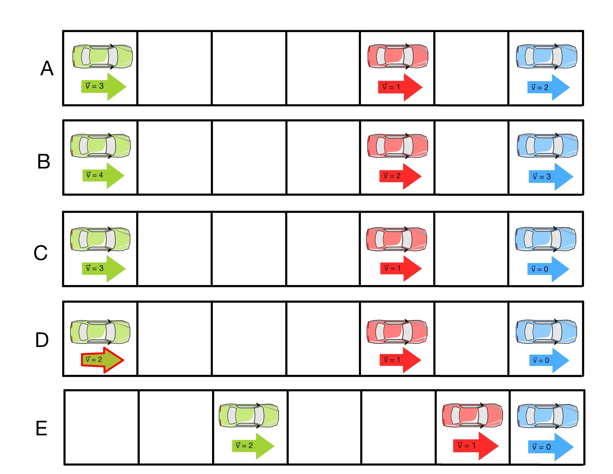
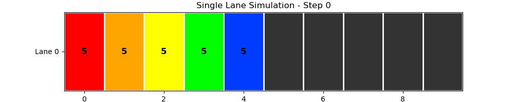

# Modeling Traffic Using the Nagel–Schreckenberg Model
#### Natalie Gray, Meredith Pritchard, Judah Byars, Inhyeok Cho, and Emma Horner

## Introduction 
Traffic flow is a classic example of a complex system in which simple local rules lead to rich global behavior. Even when all drivers behave “normally,” large-scale stop-and-go waves can appear. Studying these emergent traffic patterns can help us understand congestion, optimize road design, and test ideas about self-organization in dynamical systems.

The Nagel–Schreckenberg (NS) model is a cellular-automaton framework used to simulate freeway traffic dynamics. It captures how traffic jams emerge as a collective phenomenon: when vehicle density increases, interactions between neighboring cars naturally lead to reduced speeds and stop-and-go patterns.

Taking inspiration from the NS model, in this project we implement a simple cellular automaton model to simulate the onset of traffic, extending it to include lane-changing behavior in a multi-lane roadway. The roadway is represented as a discrete grid with periodic boundary conditions, where each cell is either empty or occupied by a single car with an associated velocity  $v$. Because only one vehicle can occupy a cell at a time, local interactions determine how cars accelerate, brake, or shift lanes.

In this system, time evolves in discrete steps. At each time step, every vehicle updates its state according to the model rules: it may advance forward, change lanes (in the multi-lane case), adjust its speed, or become part of a traffic jam depending on its surroundings.

## Implementation
### Single lane implementation:
First, we implement a single lane traffic model as our baseline. The road is represented by a 1D array where each position corresponds to a “cell” one car may occupy. We randomly place several cars into these cells, assigning each cell a value:
- $v = -1$     → cell is empty, no car occupies that cell.
- $v = 0-5$     → cell is occupied by a car with velocity $0-5$.

Starting from these initial conditions, we update the system over discrete time steps. During each update, the model applies a sequence of rules - acceleration, braking, random slowing, and movement - which define how traffic evolves.
1. Acceleration: Any car not already at the maximum speed increases its velocity by 1.
2. Slowing down: Each car checks the number of empty cells ahead. If this distance is smaller than its current velocity, the velocity is reduced to match the available space and avoid collision.
3. Randomization: With probability $p$ any car with $v$ > 0 decreases its velocity by 1 to model random driver behavior.
4. Motion: Finally, each car advances forward a number of cells equal to its (possibly adjusted) velocity.

Below is a visualization of one full update of the single lane model. Each iteration consists of steps A–E:


<table>
  <tr>
    <td width="25%" valign="center" style="padding-right: 25px;">
      <div style="line-height: 2.0;">
        <p><b>(A)</b> cars start with their initial velocities. </p>
        <p><b>(B)</b> each car accelerates $v$ → $v+1$ (if $v<5$). </p>
        <p><b>(C)</b> cars reduce speed if the space ahead is limited. </p>
        <p><b>(D)</b> cars may randomly slow down (here the green car slows down $v$ → $v-1$). </p>
        <p><b>(E)</b> cars move forward according to their final velocity. </p>
      </div>
    </td>
    <td width="75%" valign="center">
      <div align="center">
      
    </td>
  </tr>
</table>


### Multiple lane implementation: 
Next, we implement a model for multi-lane traffic. Now our road has expanded so that it is created with a 2D-array where, like before, each cell either has a car with some velocity $v = 0-5$, or is empty ($v = -1$). The multiple lanes implementation is essentially made of independent single lanes from before, with the adddition of lane changing. Due to the new interaction of changing lanes, the system now evolves according to the following new rules:

1. Any car that can not move forwards unimpeded, but has room in an adjacent lane, will be placed in a lane-change queue. 
2. For each queued car, the multi-lane model introduces the following decision rules:
- Switch to the adjacent lane that lets it travel farther.
- If both lanes offer the same distance, choose randomly.
- If neither lane provides an advantage, the car stays in the original lane.
  
## Installation and Basic Usage

1. Clone repository: ```git clone https://github.com/negray03/PHY-381C-Final-Project-Onset-of-Traffic/tree/main ```
2. Install necessary libraries:
  ```
  pip install numpy
  pip install matplotlib
  ```
3. Run models inside the ```Lanes.ipynb``` notebook:

Run the single lane model:
```
model = Traffic(n, density, vmax, p)
model.simulate(n_step)
```
     
Run the multi-lane lane model:
```
Model = Multi_Lane_Traffic(cells, lanes, density, vmax, p, random_state)
Model.simulate(n_step)
```

The parameters for each model are: 
- ```n``` (int) also called ```cells``` (int) in the multi-lane model: Length of the road (number of cells)
- ```density``` (float): Fraction of cells initially containing cars (0 to 1)
- ```vmax``` (int): Maximum allowed velocity
- ```p``` (float): Random slowdown probability (0 to 1)
- ```n_step``` (int): Number of iterations you want to simulate

## Results Visualization
Here we show some visualizations of our simulations. We show a simulation of the single lane model for 3 cars as well as a simulation for the multi-lane models for 10 and then 30 cars. These visualizatoins can be found in the ```visualizations/Graphs/Density&Lane_Statistic``` folder.

##### Single lane model for 3 cars:
<p align="center">
  
</p>

##### Multi-lane model for 10 cars:
<p align="center">
  
</p>

##### Multi-lane model for 80 cars:
<p align="center">
  
</p>

### Average Flow and Jamming Fraction (2D and 3D)
We simulated cells over 1000 iterations while varying the density and lane amount. Below we show the 2D (top) and 3D (bottom) average flow. The 3D plots give both the average flow and jamming feaction as the z axis. The jamming percent seemed to ignore the amount of lanes, which makes sense. However, we noticed that for low densities an increase to the amount of lanes did tend to increase the average flow rate.

<p align="center">
  
  
  
</p>

The plots above, along with the corresponding plots for 1000 iterations can be found in the ```visualizations/Graphs/Density&Lane_Statistic``` folder. 

## Conclusion

Using the Nagel–Schreckenberg model and our multi-lane extension, we were able to reproduce realistic traffic behavior with only simple local rules. The simulations showed expected patterns like free flow at low densities and traffic-jam formation caused by random slowing. Our visualizations made it easy to see these jams develop in real time and highlighted the added complexity introduced by lane changing.

### Future Directions

- Extend the model beyond a cellular automaton to a continuous framework
- Add driver-responsiveness and collision rules
- Explore optimized or adaptive initial conditions for each car

## Authors and Acknowledgments
This project was completed by Natalie Gray, Meredith Pritchard, Judah Byars, Inhyeok Cho, and Emma Horner. We want to acknowledge and thank Professor William Gilpin and Carson McVay as well. Natalie made the project proposal, basic lane implementation, and presented. Meredith made the presentation, helped with the visualizations, and presented. Judah did the multi lane implementation, the results, and presented. Ian helped with the visualizations and presented. Emma made the Readme file.

## Resources:
1. https://www.mdpi.com/1424-8220/24/23/7672

2. https://en.wikipedia.org/wiki/Nagel%E2%80%93Schreckenberg_model

3. https://jp1.journaldephysique.org/articles/jp1/abs/1992/12/jp1v2p2221/jp1v2p2221.html

4. https://github.com/christiancosgrove/traffic-numpy


